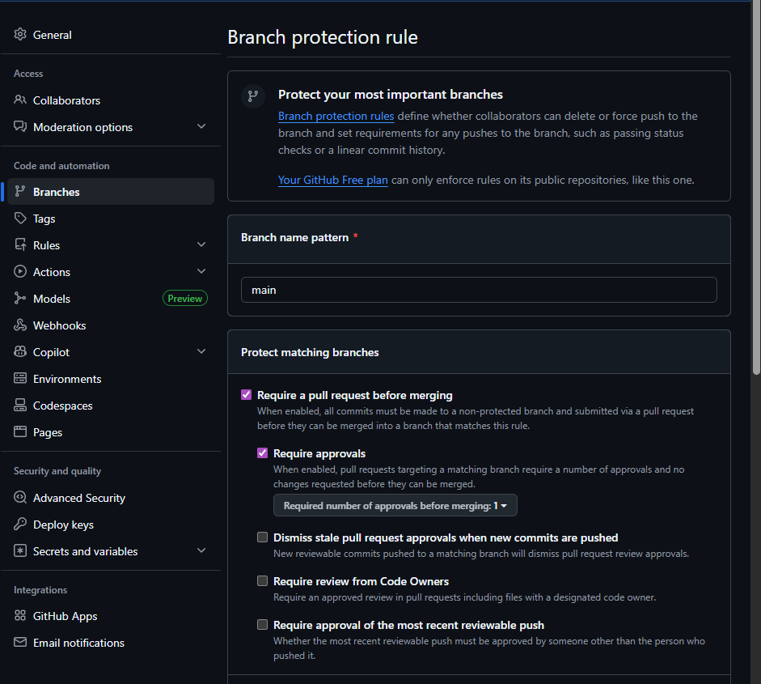
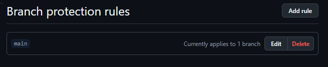

## Hasil Praktikum Git

## Deskripsi Project

Pada praktikum ini, saya membuat sebuah repository di GitHub dengan nama "praktikum-git". Repository ini digunakan untuk melakukan latihan dan eksperimen dengan berbagai fitur Git, seperti commit, branch, merge, dan pull request. Selain itu, saya juga menggunakan projek tugas akhir untuk menjadi tempat latihan dan eksperimen dengan Git.

## Hasil Praktikum

Berikut adalah hasil dokumentasi dari praktikum Git yang telah saya lakukan:

Fungsi Perintah git di foto:

1. `git clone` digunakan untuk mengkloning repository dari GitHub ke lokal komputer.
2. `git add` digunakan untuk menambahkan perubahan pada file ke staging area.
3. `git commit` digunakan untuk menyimpan perubahan yang telah ditambahkan ke staging area.
4. `git push` digunakan untuk mengirim perubahan ke repository remote.
5. `git pull` digunakan untuk mengunduh perubahan dari repository remote dan menggabungkannya dengan working directory.

Fungsi Perintah git di foto:

1. `git checkout -b` digunakan untuk membuat cabang baru dan langsung beralih ke cabang tersebut.
2. `git checkout` digunakan untuk beralih antara cabang (branch) yang berbeda dalam repository.

Fungsi beberapa merge di foto:

1. `squash and merge` digunakan untuk menggabungkan beberapa commit menjadi satu commit sebelum melakukan merge ke branch utama.
2. `merge commit` digunakan untuk menggabungkan branch fitur ke branch utama dengan cara membuat commit baru yang menggabungkan perubahan dari kedua branch, sehingga riwayat commit tetap terjaga.

Fungsi beberapa perintah di foto:

1. `git merge` digunakan untuk menggabungkan perubahan dari satu branch ke branch lainnya. Jika ada konflik, Git akan menandai file yang mengalami konflik dan meminta pengguna untuk menyelesaikannya.
2. `git status` digunakan untuk melihat status dari file yang sedang dikerjakan, termasuk file yang mengalami konflik. Perintah ini membantu pengguna untuk mengetahui file mana yang perlu diselesaikan sebelum melakukan commit.

Gambar di atas menunjukkan contoh konflik yang terjadi saat melakukan merge, di mana terdapat perubahan yang bertentangan antara dua branch. Pengguna harus menyelesaikan konflik tersebut dengan memilih perubahan mana yang akan dipertahankan atau dengan menggabungkan perubahan secara manual sebelum dapat melanjutkan proses merge.

Fungsi Perintah git di foto:

1. `git rebase` digunakan untuk memindahkan atau menggabungkan serangkaian commit ke basis baru. Perintah ini sering digunakan untuk menjaga riwayat commit yang bersih dan linear, terutama saat bekerja dengan branch fitur yang perlu diperbarui dengan perubahan dari branch utama.

Rebase akan dilakukan di vim, di mana pengguna dapat memilih commit mana yang ingin dipertahankan, diubah, atau dihapus selama proses rebase. Setelah selesai, pengguna dapat menyimpan dan keluar dari editor untuk menyelesaikan proses rebase.
Berikut contoh yang sudah di edit di vim:

`before rebase:`

`after rebase:`

## Hasil Dokumentasi

Berikut adalah hasil grafik commit:

chart selama commit diilakukan samapi feature/dark-mode :

Hasil ScreenShoot dari Branch Protection Rule :

Screenshot dari Website :

